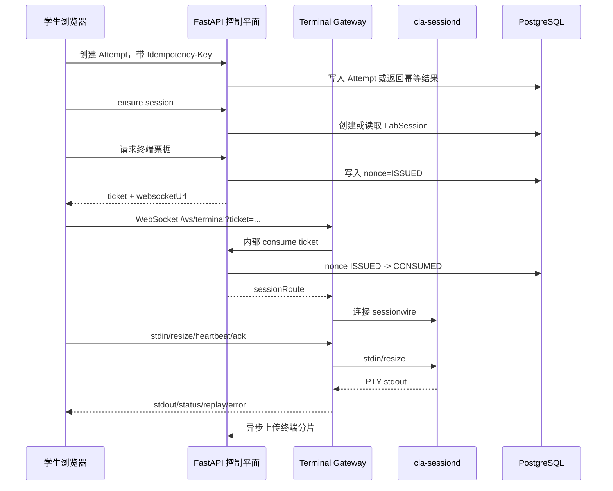
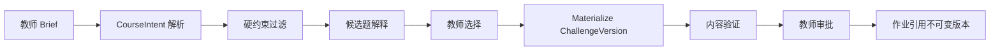
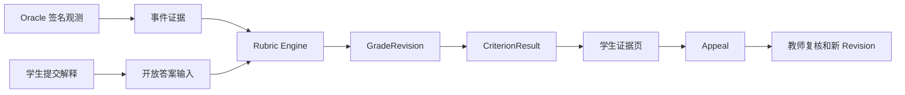

# CLA 架构说明

本文解释 CyberLab Assistant（CLA）一期终端实践平台的架构。架构基线来自 [cla_terminal_first_complete_development_spec.html](/Users/fisherder/Desktop/研究生/Security_Class_Tool/cla_terminal_first_complete_development_spec.html)，当前实现状态以 [docs/implementation/status.md](/Users/fisherder/Desktop/研究生/Security_Class_Tool/docs/implementation/status.md) 为准。

## 架构目标

CLA 一期要交付的是可验证、可审计、可扩展的终端真实靶场，而不是通用远程桌面或自由 Agent 平台。

核心目标：

- 教师能够维护 Challenge-as-Code 题目、创建作业、查看验证报告并审批发布。
- 学生能够在浏览器中打开终端，连接本人隔离 LabSession，完成实验、请求提示、提交解释并查看证据化成绩。
- 系统使用确定性 Workflow 主干管理题目发布、会话生命周期和评分发布。
- Agent 只处理 Brief 解析、候选重排、提示生成和开放答案评价。
- 一期只实现 `WorkspaceType=TERMINAL`，GUI 和模拟工作区只保留类型和 Feature Flag。

## 信任平面

系统划分为五个平面。

| 平面 | 组成 | 信任级别 | 关键边界 |
|---|---|---|---|
| 体验平面 | `apps/web` | 低信任客户端 | 只持有公开 token、终端票据和公开 API 数据 |
| 可信控制平面 | `services/api`、Temporal Worker、策略服务 | 高信任业务事实 | 拥有数据库事务、审计、票据签发和评分发布 |
| 终端接入平面 | `services/terminal-gateway` | 受限可信中继 | 持有内部服务 token，不持有 Kubernetes 管理凭据 |
| Agent 平面 | `services/agent-runtime` | 受限低信任计算 | 只能调用白名单能力，不拥有基础设施凭据 |
| 实验执行平面 | workspace、target、sessiond | 默认敌对 | 学生可影响终端、文件、进程和输出，不能作为事实来源 |

系统设计时必须优先考虑“数据从哪个信任平面来”。来自学生终端、target、附件和回答的内容一律按不可信数据处理。

## 当前部署单元

### Web

路径：`apps/web`

职责：

- 学生终端工作台。
- 成绩证据页。
- 教师题目验证页。
- 教师 live monitor 页面。

Web 不拥有业务事实。所有权限由 API 决定。

### API

路径：`services/api`

职责：

- OIDC 和 RBAC。
- 租户、用户、课程、成员、题目、题目版本、作业和 Attempt。
- LabSession 本地切片和 route registry。
- 一次性终端票据。
- 事件接入和 hash 链。
- 终端分片索引、加密对象写入、恢复校验和保留清理。
- Oracle 签名观测接入。
- Tutor 卡住检测和提示状态。
- GradeRevision、CriterionResult、Appeal 和教师 override。
- 审计和 Outbox。

API 是当前 P0/P1 的业务事实所有者。后续引入 Temporal 后，API 仍然持有领域表，Temporal 负责长时间流程和补偿。

### Terminal Gateway

路径：`services/terminal-gateway`

职责：

- 通过 API 消费一次性终端票据。
- 根据 API 返回的 `sessionRoute` 连接 sessiond。
- 维护 WebSocket 二进制帧协议。
- 转发 stdin/stdout、resize、heartbeat 和 ACK。
- 实现背压、重连 replay、错误码和指标。
- 异步上传终端录制分片到 API。

Gateway 不解析学生命令语义，不评分，不部署环境。

### Environment Controller

路径：`services/environment-controller`

职责：

- 定义 LabSession CRD。
- 规划 per-session namespace、ResourceQuota、LimitRange、Secret、Service、NetworkPolicy 和 Deployment。
- 默认使用 restricted Pod Security 和 gVisor RuntimeClass。
- 注册 route、撤销票据、扫描孤儿资源。
- 使用 fake client 和静态资源测试验证调和决策。

当前真实 Kubernetes apply 尚未运行，因此状态仍是“部分完成”。

### sessiond

路径：`runtime/sessiond`

职责：

- 在 workspace 容器内以 non-root 运行。
- 创建受限 PTY。
- 接收 Gateway 的 sessionwire 帧。
- 将 PTY 输出写回 Gateway。

sessiond 是会话内字节代理，不是控制服务。

### Agent Runtime

路径：`services/agent-runtime`

职责：

- 提供受限 Harness 和 Provider Adapter 的边界。
- 为后续 Brief Parser、Tutor 边界案例和开放答案评价提供接入位置。

当前切片中 Agent Runtime 未参与核心终端和客观评分路径。关闭 Agent 不应影响终端和 Oracle 评分。

## 数据模型概览

核心表按领域分组：

| 领域 | 表 | 说明 |
|---|---|---|
| 租户和身份 | `tenants`、`users` | 租户、OIDC subject、展示名和账号状态 |
| 课程 | `courses`、`course_members` | 课程、学期、教师、学生和助教关系 |
| 内容 | `challenges`、`challenge_versions`、`validation_runs`、`challenge_drafts` | Challenge-as-Code、不可变版本、验证报告和教师 Brief 草稿 |
| 作业和尝试 | `assignments`、`attempts` | 作业引用题目版本，Attempt 绑定学生、seed 和状态 |
| 实验会话 | `lab_sessions`、`terminal_ticket_nonces` | 会话 epoch、workspace 类型、route、过期时间和票据 nonce |
| 事件和转录 | `event_streams`、`events`、`transcript_segments` | 语义事件、hash 链和终端对象索引 |
| 辅助 | `stuck_assessments`、`hints` | 卡住检测、提示等级、反馈和独立完成指数 |
| 评分 | `grade_revisions`、`criterion_results`、`appeals` | 不可变成绩版本、criterion 证据和申诉 |
| Agent 和审计 | `agent_runs`、`audit_logs`、`outbox` | Agent 输入输出版本、审计和异步投递 |

领域规则：

- ChallengeVersion、Rubric、Prompt、模型策略和题目包 artifact 应按版本不可变。
- Attempt 不随题目新版本变化。
- LabSession reset 产生新 epoch，旧 route 和票据应失效。
- GradeRevision 不覆盖，教师改分形成新版本。
- Event 和 Audit 只追加。

## 终端连接链路

安全要点：

- Web 永远不知道 `route_ref` 和 sessiond endpoint。
- Ticket 60 秒过期并且 nonce 单次消费。
- reset 或 route unregister 后旧票据应被拒绝。
- Gateway 到 API 的 consume 使用内部服务 token。

## 题目发布链路

当前实现为本地确定性切片：

- Brief Parser 是规则化函数。
- 候选检索基于内置题目包。
- 内容验证覆盖 Schema、Rubric、target smoke、Oracle 正负例和报告。
- 审批由教师 API 完成。

后续引入模型时，模型只能输出候选和草稿，不能直接部署或发布。

## 评分链路

评分规则：

- 客观 criterion 优先使用 Oracle。
- 事件模式只能引用平台或外部签名事件。
- LLM_RUBRIC 后续只用于开放答案评价。
- 每个 CriterionResult 必须有 evidence_refs、grader_version、confidence 和 explanation。
- 申诉不修改原成绩，教师复核产生新 GradeRevision。

## 转录和对象存储链路

终端语义事件和原始字节分开处理：

- shell hook 产生 `command.completed` 等语义事件。
- Gateway 异步提交原始输入/输出分片。
- API 使用 AES-GCM 加密分片，并写入 local 或 S3 兼容对象后端。
- 数据库 `transcript_segments` 只保存对象引用、hash、序号范围、方向和脱敏状态。
- 恢复校验只验证对象存在、hash 匹配和可解密性，不把明文返回给调用方。

这样可以支持证据追溯和恢复演练，同时降低普通查询泄露终端敏感内容的风险。

## Kubernetes 目标形态

生产目标形态：

- 每个 session epoch 独立命名空间。
- ResourceQuota 和 LimitRange 限制 CPU、内存和临时存储。
- 默认拒绝 ingress 和 egress。
- 只允许 Gateway 访问 workspace sessiond。
- 只允许 workspace 访问 target 所需端口。
- 使用 restricted Pod Security。
- 默认 RuntimeClass 为 gVisor，高风险调试题按需验证 Kata。
- 禁止 privileged、hostPath、hostNetwork、hostPID 和自动挂载 ServiceAccount token。
- Finalizer、TTL 和 orphan scanner 清理资源。

当前代码已经有规划和 fake-client 测试，但真实集群验证仍未完成。

## 为什么 API 仍是模块化单体

当前阶段把课程、题目、Attempt、评分和申诉放在 `services/api` 内，是为了保证事务一致、开发速度和测试可控。终端字节中继、环境控制和 Agent Runtime 已经保持独立部署边界。若后续出现明确的吞吐、团队或权限压力，应先稳定 OpenAPI/Protobuf/事件契约，再按领域拆分服务。

## 与 Temporal 的关系

Temporal 负责长时间、可重试、需要人工审批或补偿的流程：

- PublishChallengeWorkflow。
- SessionLifecycleWorkflow。
- GradingWorkflow。
- 备份恢复和保留清理批处理。

当前 P1 未运行真实 Temporal，使用同步确定性路径验证领域不变量。后续迁入 Temporal 时，API 仍负责写领域事实，Workflow 负责活动编排和状态推进。

## 可观测性目标

指标和日志必须支持以下问题：

- API 请求量、错误码、延迟和授权拒绝。
- session provision 时间、失败原因和 orphan 数量。
- Gateway active connection、terminal bytes、reconnect、replay gap、backpressure 和 ticket reject。
- Controller reconcile 次数、错误、清理结果和 Kubernetes Event。
- Agent 调用量、模型、成本、schema 失败和策略拒绝。
- Tutor outcome、误判反馈、提示等级和独立完成指数。
- Grading drift、低置信数量、教师 override 和申诉结果。

敏感值不得进入普通日志和 Trace 标签。
