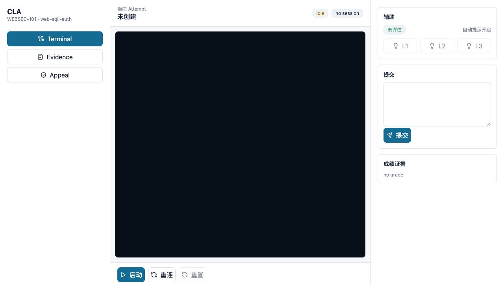
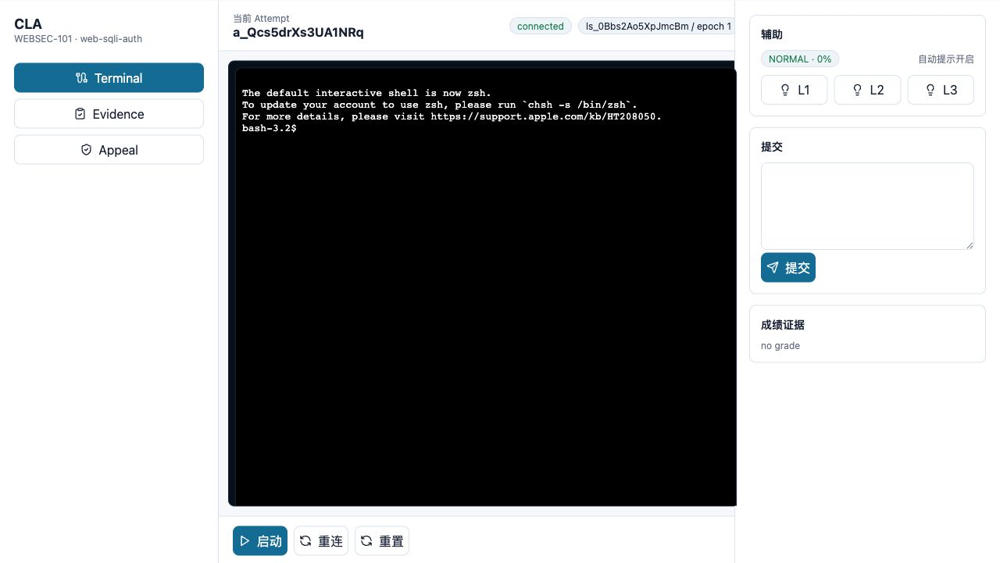
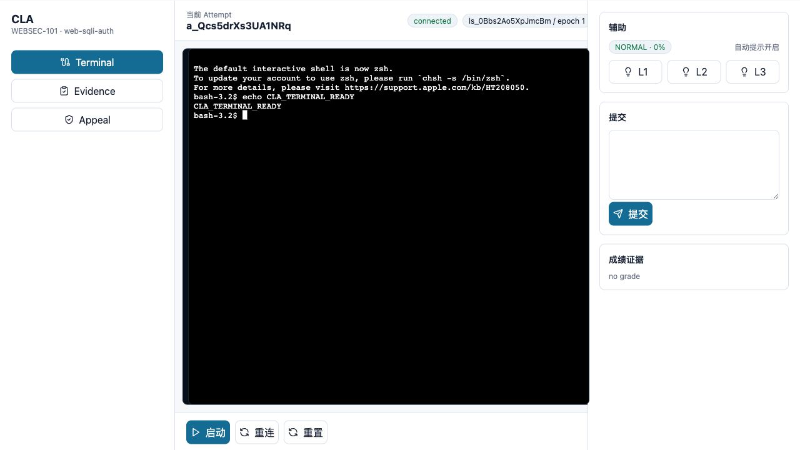
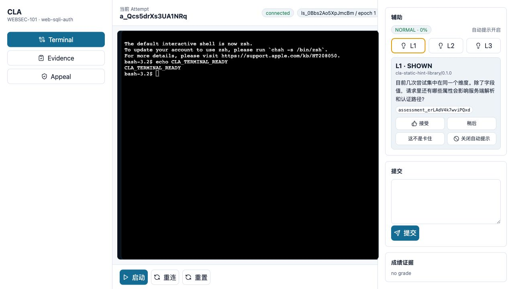
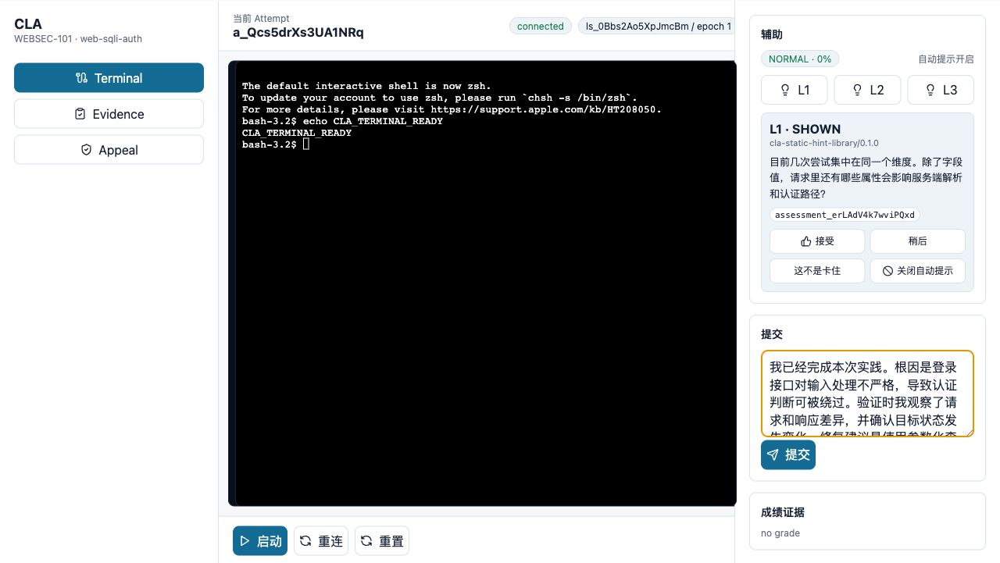
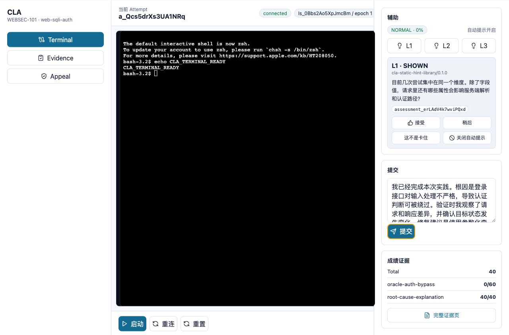
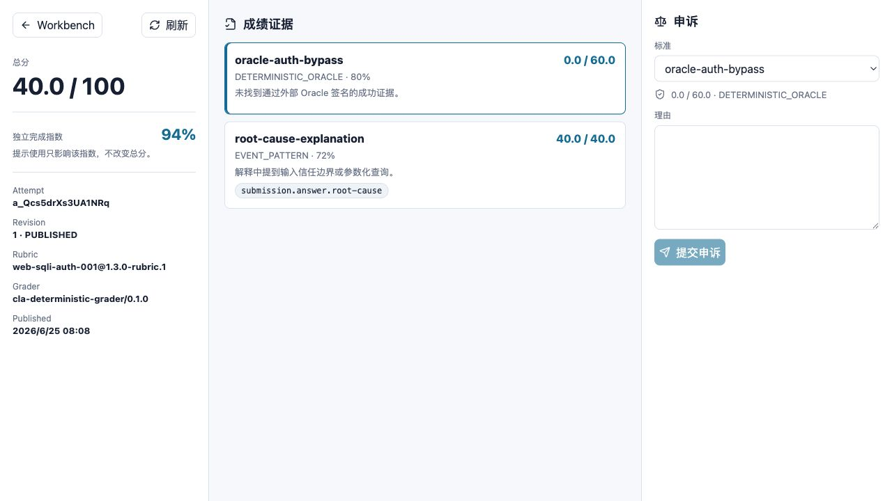
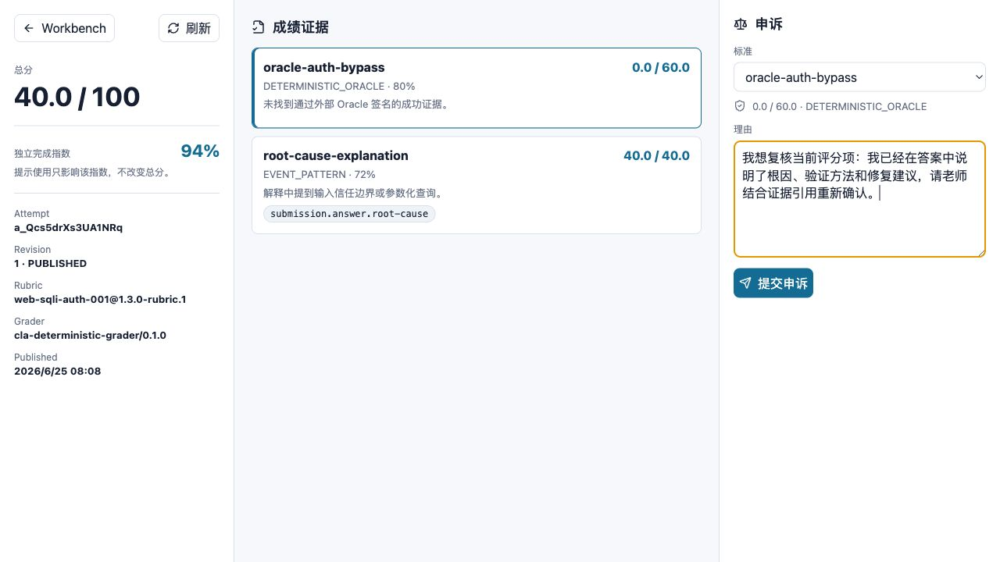
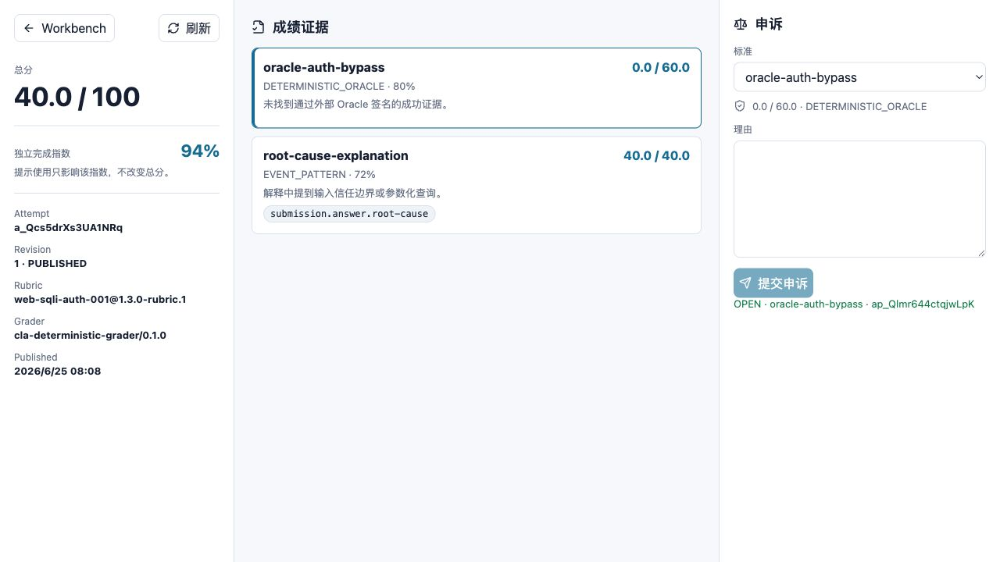

# CyberLab Assistant（CLA）学生端使用手册

从进入系统到提交答案、查看成绩、提交申诉的完整点击步骤

- 适用对象：网安实践课程学生
- 生成日期：2026-06-25
- 项目名称：CyberLab Assistant（CLA）

## 目录

1. [先读这一页](#先读这一页)
2. [进入系统](#进入系统)
3. [认识工作台](#认识工作台)
4. [启动实验](#启动实验)
5. [在终端输入命令](#在终端输入命令)
6. [重连和重置怎么选](#重连和重置怎么选)
7. [请求提示](#请求提示)
8. [填写答案](#填写答案)
9. [提交后看成绩摘要](#提交后看成绩摘要)
10. [查看完整证据页](#查看完整证据页)
11. [提交申诉](#提交申诉)
12. [常见问题](#常见问题)
13. [学生端操作清单](#学生端操作清单)

<a id="先读这一页"></a>
## 1. 先读这一页

这份手册只讲你在页面上怎么用 CLA。你不需要理解后台服务、接口或部署。按截图和步骤操作即可。

1. 登录或注册账号。
2. 点击“启动”。
3. 在黑色终端里输入命令。
4. 需要帮助时点 L1、L2 或 L3。
5. 在右侧输入答案并点“提交”。
6. 点击“完整证据页”查看成绩。
7. 如果认为某项评分有问题，填写理由并点“提交申诉”。

> **进入方式**：老师会告诉你系统地址。已有账号时直接登录；没有账号时点击“注册”，账号类型选择“学生”。


<a id="进入系统"></a>
## 2. 进入系统

上课时，老师会告诉你系统地址。用浏览器打开后，如果还没有登录，会先看到 CLA 登录页；登录或注册成功后，你会进入学生工作台。页面左上角显示 CLA，左侧有 Terminal、Evidence、Appeal 三个入口。



*刚进入学生工作台时，当前 Attempt 显示“未创建”，底部有“启动”按钮。*

1. 打开老师给你的网址。
2. 如果已有账号，输入邮箱和密码，然后点击“登录”。
3. 如果还没有账号，点击“注册”，填写邮箱、姓名、密码，账号类型选择“学生”，再点击“创建账号并进入”。
4. 看到左侧 Terminal 高亮，说明你已经在终端工作台。
5. 看到当前 Attempt 是“未创建”，说明你还没有开始本次实验。
6. 离开公共电脑前，点击左侧“退出登录”。


<a id="认识工作台"></a>
## 3. 认识工作台

| 区域 | 你看到什么 | 用来做什么 |
| --- | --- | --- |
| 左侧栏 | Terminal、Evidence、Appeal | 切换终端、证据和申诉相关入口 |
| 顶部 | 当前 Attempt、idle/connected、session | 查看实验是否已经启动 |
| 中间黑色区域 | 终端窗口 | 输入命令、查看输出 |
| 底部按钮 | 启动、重连、重置 | 启动或恢复实验环境 |
| 右侧辅助 | L1、L2、L3 | 请求分级提示 |
| 右侧提交 | 文本框、提交按钮 | 写答案并提交 |
| 右侧成绩证据 | Total、完整证据页 | 提交后查看成绩入口 |

> **先启动**：刚进入页面时，L1/L2/L3 可能可见但还不能有效使用。请先点击“启动”。


<a id="启动实验"></a>
## 4. 启动实验

1. 点击页面底部的“启动”。
2. 等待顶部状态从 idle 变成 connected。
3. 看到 session 和 epoch 信息后，说明实验环境已经连接。
4. 黑色终端窗口中出现命令提示符后，就可以输入命令。



*点击“启动”后，顶部状态变为 connected，表示终端已连接。*

| 状态 | 意思 | 你应该做什么 |
| --- | --- | --- |
| idle | 还没启动 | 点击“启动” |
| provisioning | 正在准备实验 | 等待，不要反复点击 |
| connected | 已经连接 | 开始输入命令 |
| closed | 连接关闭 | 点击“重连” |
| error | 连接出错 | 先重连，仍失败就联系老师 |


<a id="在终端输入命令"></a>
## 5. 在终端输入命令

终端是黑色区域。点击黑色区域后，直接输入命令并按 Enter。



*示例：点击黑色终端区域，输入 echo CLA_TERMINAL_READY，然后按 Enter。*

1. 用鼠标点击黑色终端区域。
2. 输入老师要求的命令，或按题目说明进行操作。
3. 按 Enter 执行命令。
4. 根据终端输出继续分析。

```text
echo CLA_TERMINAL_READY
```

> **安全提醒**：不要在终端里输入或打印自己的密码、token、Cookie、Authorization 等敏感信息。


<a id="重连和重置怎么选"></a>
## 6. 重连和重置怎么选

| 按钮 | 什么时候点 | 会发生什么 |
| --- | --- | --- |
| 重连 | 页面显示 closed，或网络短暂断开 | 保留当前实验，重新连接终端 |
| 重置 | 环境被自己改坏、无法继续，或老师要求 | 重新准备实验环境，可能清空当前状态 |

> **优先重连**：一般先点“重连”，不要一出问题就点“重置”。重置可能让你丢失当前环境中的操作结果。


<a id="请求提示"></a>
## 7. 请求提示

如果卡住，可以在右侧辅助面板点 L1、L2 或 L3。L1 最轻，L3 更具体。



*点击 L1 后，右侧会出现提示卡片，并显示“接受”“稍后”“这不是卡住”“关闭自动提示”。*

1. 点击 L1 获取轻提示。
2. 如果仍然不知道怎么做，再点击 L2。
3. 确实长时间无法推进时，再点击 L3。
4. 提示有帮助就点“接受”。
5. 暂时不想看就点“稍后”。
6. 如果系统误判你卡住，点“这不是卡住”。
7. 不想再自动收到提示，点“关闭自动提示”。

| 提示等级 | 适合什么时候用 |
| --- | --- |
| L1 | 不知道下一步方向时 |
| L2 | 尝试几次仍然没有进展时 |
| L3 | 临近截止或长时间卡住时 |

> **提示和成绩**：使用提示不会直接扣总分。页面中的“独立完成指数”会反映你使用提示的情况。


<a id="填写答案"></a>
## 8. 填写答案

完成实验后，在右侧“提交”区域填写答案。答案要写你理解到的原因和验证过程，不要只贴一条命令。



*在右侧提交框中输入答案。写完后检查一遍，再点击“提交”。*

1. 找到右侧“提交”标题下面的文本框。
2. 写清楚你发现的问题是什么。
3. 写清楚你是怎么验证的。
4. 如果题目要求，补充影响和修复建议。
5. 确认没有写入密码、token 或不该公开的内容。
6. 点击蓝色“提交”按钮。

> **答案建议**：好答案通常包括：根因、关键现象、验证方式、修复建议。不要只写“完成了”或只贴终端输出。


<a id="提交后看成绩摘要"></a>
## 9. 提交后看成绩摘要



*点击提交后，右侧成绩证据区域会出现 Total 和每个评分项的简要得分。*

1. 点击“提交”后等待几秒。
2. 查看右侧“成绩证据”。
3. 先看 Total 总分。
4. 再看每个评分项的分数。
5. 点击“完整证据页”查看详细解释。


<a id="查看完整证据页"></a>
## 10. 查看完整证据页



*完整证据页左侧是总分和版本信息，中间是每个评分项，右侧是申诉入口。*

1. 点击工作台右侧的“完整证据页”。
2. 左侧查看总分和独立完成指数。
3. 中间查看每个评分项。
4. 点击某个评分项，会在右侧申诉区域同步选择该项。
5. 阅读评分项下方的解释，判断自己失分原因。

| 页面内容 | 怎么理解 |
| --- | --- |
| 总分 | 本次提交的总成绩 |
| 独立完成指数 | 提示使用情况的参考指标，不直接等于分数 |
| Revision | 成绩版本，老师复核后可能变化 |
| 评分项 | 每一项具体分数和说明 |
| 证据标签 | 系统记录的评分依据，不需要手动复制 |


<a id="提交申诉"></a>
## 11. 提交申诉

如果你认为某一项评分有问题，可以在完整证据页右侧提交申诉。申诉要针对具体评分项，说清楚理由。



*选择评分项，在理由框中写明为什么需要老师复核。*

1. 在右侧“申诉”区域，先选择要申诉的标准。
2. 在“理由”文本框中写清楚复核原因。
3. 说明你认为哪个评分项、哪条解释或哪个证据有问题。
4. 点击“提交申诉”。
5. 看到 OPEN 和申诉编号后，说明申诉已经提交。



*提交成功后，页面右侧会显示 OPEN、评分项和申诉编号。*

> **申诉内容**：不要在申诉里写密码、token、Cookie、同学信息或平台内部地址。只写和评分有关的事实。


<a id="常见问题"></a>
## 12. 常见问题

| 问题 | 先做什么 | 还不行怎么办 |
| --- | --- | --- |
| 点启动后没反应 | 等几秒，不要连续点 | 刷新页面后重试，仍失败联系老师 |
| 状态是 closed | 点击“重连” | 仍失败联系老师 |
| 终端没法输入 | 先点击黑色终端区域 | 刷新页面并重连 |
| 不知道下一步 | 先点 L1 | 再点 L2 或向老师说明已尝试步骤 |
| 提交后没有成绩 | 等几秒再看右侧成绩证据 | 点击完整证据页或联系老师 |
| 申诉提交不了 | 确认选择了评分项，理由不少于几个字 | 刷新成绩页后重试 |


<a id="学生端操作清单"></a>
## 13. 学生端操作清单

- [ ] 我已经进入学生工作台。
- [ ] 我点击了“启动”，状态变成 connected。
- [ ] 我在黑色终端里完成了题目要求。
- [ ] 我需要帮助时按顺序使用了 L1、L2、L3。
- [ ] 我在提交框中写了根因和验证过程。
- [ ] 我点击了“提交”。
- [ ] 我打开“完整证据页”查看了每个评分项。
- [ ] 如果要申诉，我选择了具体评分项并写清了理由。
