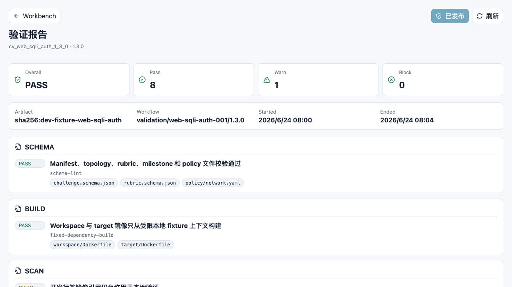
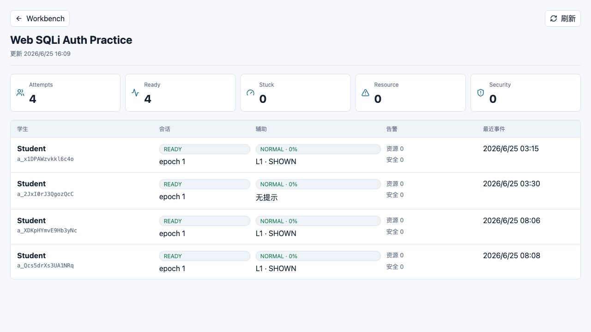

# CyberLab Assistant（CLA）教师端使用手册

只讲教师在页面上怎么操作：看验证、发布题目、看课堂状态

- 适用对象：教师、助教、课程负责人
- 生成日期：2026-06-25
- 项目名称：CyberLab Assistant（CLA）

## 目录

1. [先读这一页](#先读这一页)
2. [进入教师端](#进入教师端)
3. [查看题目验证报告](#查看题目验证报告)
4. [阅读验证项](#阅读验证项)
5. [刷新验证报告](#刷新验证报告)
6. [查看作业实时监控](#查看作业实时监控)
7. [查看学生行](#查看学生行)
8. [刷新作业实时监控](#刷新作业实时监控)
9. [教师端常见问题](#教师端常见问题)

## 1. 先读这一页

这份手册只面向教师实际使用，不讲代码、接口和部署。你只需要知道打开哪个页面、看哪些数字、点哪些按钮。

> **当前页面范围**：当前教师端已经暴露给用户的页面主要有两个：题目验证报告页、作业实时监控页。课程创建、申诉复核等后台能力目前还没有教师图形界面，所以本手册不把它们写成可点击步骤。

| 你想做什么 | 使用哪个页面 | 主要按钮 |
| --- | --- | --- |
| 确认题目能不能发布 | 验证报告 | 刷新、审批发布或已发布 |
| 查看学生实验状态 | 作业实时监控 | 刷新 |
| 回到学生工作台 | 页面左上角 Workbench | Workbench |

## 2. 进入教师端

教师端没有单独的复杂首页。上课或演示前，管理员通常会给你教师端网址，或者先帮你登录好账号。你只需要在浏览器地址栏打开对应链接。

1. 打开管理员给你的系统地址。
2. 如果看到统一登录页，按学校账号登录。
3. 如果管理员给的是试用链接，直接打开即可。
4. 进入教师页面后，先确认页面标题是你要看的题目或作业。

> **地址说明**：本地演示环境默认页面地址是 http://127.0.0.1:3000。正式上课时请使用管理员提供的真实地址。

## 3. 查看题目验证报告

题目验证报告用于确认一个题目版本是否适合发布给学生。你不需要理解所有内部细节，只要先看顶部四个数字和右上角按钮。

*教师端验证报告页：先看 Overall、Pass、Warn、Block，再看右上角按钮。*

1. 打开教师端验证报告页面。
2. 先看左上标题“验证报告”，确认下面的题目版本是本次要发布的版本。
3. 看四个卡片：Overall、Pass、Warn、Block。
4. Block 如果是 0，通常表示没有阻断发布的问题。
5. Warn 如果不是 0，需要继续往下看警告项说明。
6. 点击右上角“刷新”，可以重新读取最新状态。
7. 如果右上角显示“审批发布”，并且 Block 是 0，确认无误后可以点击它发布题目。
8. 如果右上角显示“已发布”，说明这个题目版本已经可以被作业使用。

| 你看到的内容 | 怎么理解 | 该做什么 |
| --- | --- | --- |
| Overall = PASS | 整体通过 | 可以继续检查 Warn 和下面的检查项 |
| Overall = WARN | 有警告但未阻断 | 阅读 Warn 内容，确认课堂是否可接受 |
| Overall = BLOCK | 存在阻断问题 | 不要发布，联系内容负责人修复 |
| Block = 0 | 没有阻断项 | 可以进入发布判断 |
| Block 大于 0 | 有严重问题 | 不要点击发布 |

## 4. 阅读验证项

验证报告下面会列出一组检查项。教师日常只需要看每一组左侧的 PASS、WARN 或 BLOCK，以及粗体标题。灰色小标签是证据编号，保留给复核时查看。

1. 从上到下浏览检查项。
2. 看到 PASS，表示这一项通过。
3. 看到 WARN，读右侧标题，判断是否影响课堂使用。
4. 看到 BLOCK，停止发布，把页面截图或版本号发给内容负责人。
5. 不要把 Forbidden disclosure classes 里的词理解为泄露内容；它表示系统检查过这些风险类别。

> **不要发给学生**：你不需要把证据标签复制给学生。验证报告是教师使用的质量检查页面，不是学生解题提示。

## 5. 刷新验证报告

*点击右上角“刷新”后，页面会重新加载当前验证结果。*

1. 点击右上角“刷新”。
2. 等待按钮恢复可点击状态。
3. 再次查看 Overall、Warn、Block。
4. 如果数字没有变化，说明当前报告已经是最新可见状态。

## 6. 查看作业实时监控

作业实时监控用于课堂中快速看学生是否开始、实验是否就绪、是否有人卡住。它不是监控学生隐私的页面，也不显示完整终端内容。

*教师端作业实时监控页：顶部是班级统计，下面每行是一名学生的 Attempt。*

1. 打开作业实时监控页面。
2. 确认标题是当前作业，例如 Web SQLi Auth Practice。
3. 看顶部五个卡片：Attempts、Ready、Stuck、Resource、Security。
4. 如果 Ready 少于 Attempts，说明有学生实验环境还没就绪。
5. 如果 Stuck 大于 0，可以关注对应学生，但不要直接给答案。
6. 如果 Resource 或 Security 大于 0，优先联系助教或管理员排查。
7. 点击右上角“刷新”，更新当前课堂状态。

| 卡片 | 意思 | 教师建议 |
| --- | --- | --- |
| Attempts | 已经开始作业的学生次数 | 用来确认是否都已进入实验 |
| Ready | 实验环境已就绪的数量 | 低于 Attempts 时关注环境问题 |
| Stuck | 可能卡住的学生数量 | 适合课堂巡查或提醒学生看提示 |
| Resource | 资源类告警数量 | 可能是环境或性能问题 |
| Security | 安全类告警数量 | 需要谨慎处理，不直接等同作弊 |

## 7. 查看学生行

监控表格中每一行对应一个学生的当前 Attempt。教师主要看“会话”“辅助”“告警”和“最近事件”。

| 列名 | 你看到什么 | 怎么处理 |
| --- | --- | --- |
| 学生 | 学生显示名和 Attempt 编号 | 需要定位学生时使用 |
| 会话 | READY、epoch 等状态 | READY 表示实验环境可用 |
| 辅助 | NORMAL、L1 SHOWN 等 | 提示学生可继续尝试或查看提示 |
| 告警 | 资源和安全数字 | 非 0 时优先排查 |
| 最近事件 | 最近活动时间 | 长时间不变时可以询问学生是否遇到问题 |

> **状态解释**：辅助状态不是分数，也不是作弊判断。它只是帮助教师发现谁可能需要帮助。

## 8. 刷新作业实时监控

*点击“刷新”后，页面会更新 Attempts、Ready 和学生列表状态。*

1. 点击右上角“刷新”。
2. 查看页面上方“更新”时间是否变化。
3. 重新检查 Stuck、Resource、Security 三个数字。
4. 课堂中建议每隔几分钟刷新一次，而不是一直盯着单个学生。

## 9. 教师端常见问题

| 现象 | 可能原因 | 用户该怎么做 |
| --- | --- | --- |
| 页面打不开 | 地址不对或服务未启动 | 确认网址，联系管理员 |
| 验证报告显示 BLOCK | 题目还不能发布 | 不要发布，截图发给内容负责人 |
| 审批按钮显示已发布 | 题目已经发布过 | 不用重复操作 |
| 实时监控没有学生 | 学生还没点击启动，或进错作业 | 让学生进入正确作业并点击启动 |
| Ready 数量少 | 部分实验环境未就绪 | 让学生稍等，必要时联系助教 |
| Stuck 数量高 | 很多学生可能卡住 | 给全班做方向性提醒，不要直接公布答案 |
